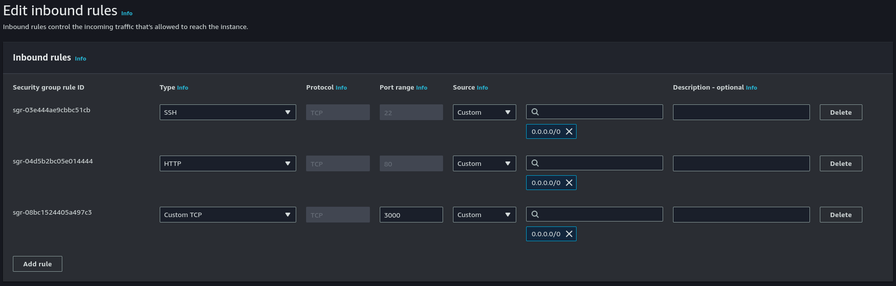
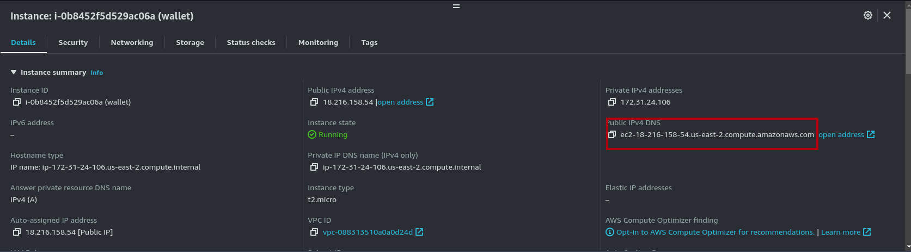

How to deploy nodejs app to AWS EC2 Ubuntu 22 Server with free SSL and Nginx reverse proxy
## Installation instructions

### 1. Launch amazon ubuntu server in aws + Attach Elastic IP to the new instance




### 2. ssh to ubuntu to install packages

```sh
ssh -i <key.pem> ubuntu@<ip-address> -v
```

### 3. Update and Upgrade linux machine and install node and nvm 

```sh
sudo apt update
```

```sh
sudo apt upgrade
```

```sh
sudo apt install -y git htop wget
```

#### 3.1 install node

To **install** or **update** nvm, you should run the [install script][2]. To do that, you may either download and run the script manually, or use the following cURL or Wget command:
```sh
curl -o- https://raw.githubusercontent.com/nvm-sh/nvm/v0.39.1/install.sh | bash
```
Or
```sh
wget -qO- https://raw.githubusercontent.com/nvm-sh/nvm/v0.39.1/install.sh | bash
```

Running either of the above commands downloads a script and runs it. The script clones the nvm repository to `~/.nvm`, and attempts to add the source lines from the snippet below to the correct profile file (`~/.bash_profile`, `~/.zshrc`, `~/.profile`, or `~/.bashrc`).

#### 3.2 Copy & Past (each line separately)
<a id="profile_snippet"></a>
```sh
export NVM_DIR="$HOME/.nvm"
[ -s "$NVM_DIR/nvm.sh" ] && \. "$NVM_DIR/nvm.sh"  # This loads nvm
[ -s "$NVM_DIR/bash_completion" ] && \. "$NVM_DIR/bash_completion"  # This loads nvm bash_completion
```

#### 3.3 Verify that nvm has been installed

```sh
nvm --version
```

#### 3.4 Install node

```sh
nvm install --lts # Latest stable node js server version
```

#### 3.5 Check nodejs installed
```sh
node --version
```

#### 3.6 Check npm installed
```sh
npm -v
```

### 4. Clone nodejs-ssl-server repository

```sh
cd /home/ubuntu
```

```sh
git clone {your project}
```

### 5. Run node app.js  (Make sure everything working)

```sh
cd {your project}
```

```sh
npm install
```

```sh
node app.js
```

### 6. Install pm2
```sh
npm install -g pm2 
```
```sh
# may require sudo
```

### 7. Starting the app with pm2 (Run nodejs in background and when server restart)
```sh
pm2 start app.js
```
```sh
pm2 save
```
```sh
# saves the running processes
    # if not saved, pm2 will forget
    # the running apps on next boot
```

#### 7.1 IMPORTANT: If you want pm2 to start on system boot
```sh
pm2 startup
```
```sh
 # starts pm2 on computer boot
```

### 8. FREE SSL - Install Nginx web server

```sh
sudo apt install nginx
```

```sh
sudo nano /etc/nginx/sites-available/default
```

#### Add the following to the location part of the server block

```sh
    location / {
        proxy_pass http://localhost:{port}; #whatever port your app runs on (3000,8080)
        proxy_http_version 1.1;
        proxy_set_header Upgrade $http_upgrade;
        proxy_set_header Connection 'upgrade';
        proxy_set_header Host $host;
        proxy_cache_bypass $http_upgrade;
    }
```


```sh
    server_name {your public domain};
```

here you can find your public domain provided by aws



##### Check NGINX config
```sh
sudo nginx -t
```

```sh
sudo systemctl reload nginx
```


## Credit 🙏😃
### https://jonathans199.medium.com/how-to-deploy-node-express-api-to-ec2-instance-in-aws-bc038a401156
 1. Subscribe to My youtube channel and leave a comment: http://www.youtube.com/@ScaleUpSaaS?sub_confirmation=1
 2. Buy me A coffee ❤️ : https://www.buymeacoffee.com/scaleupsaas
  